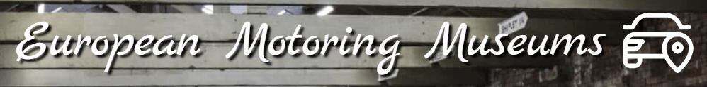
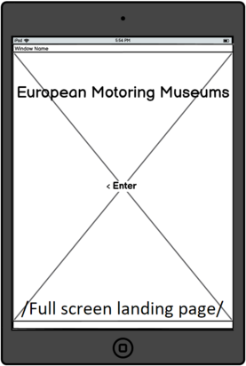
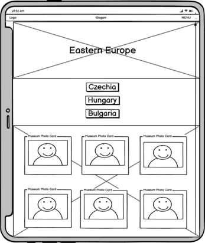
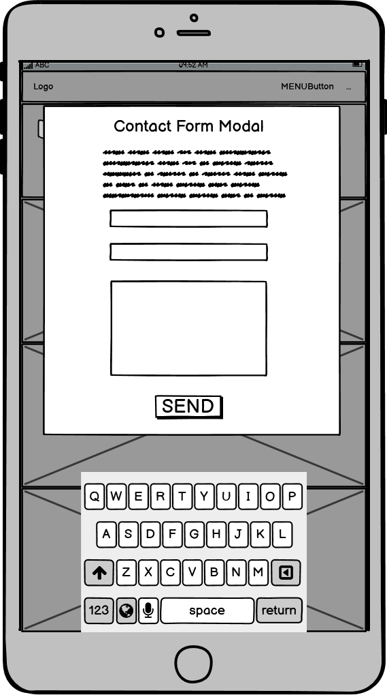
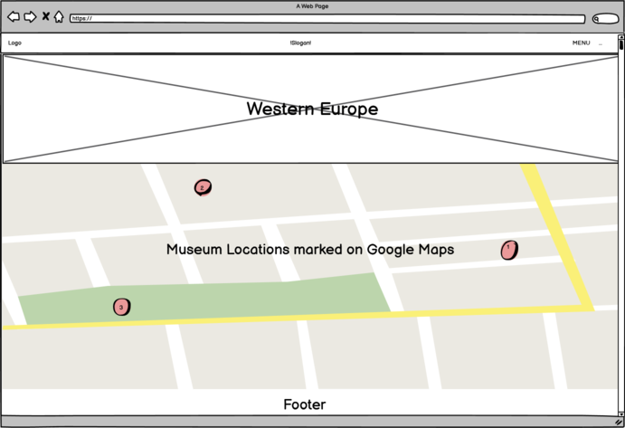
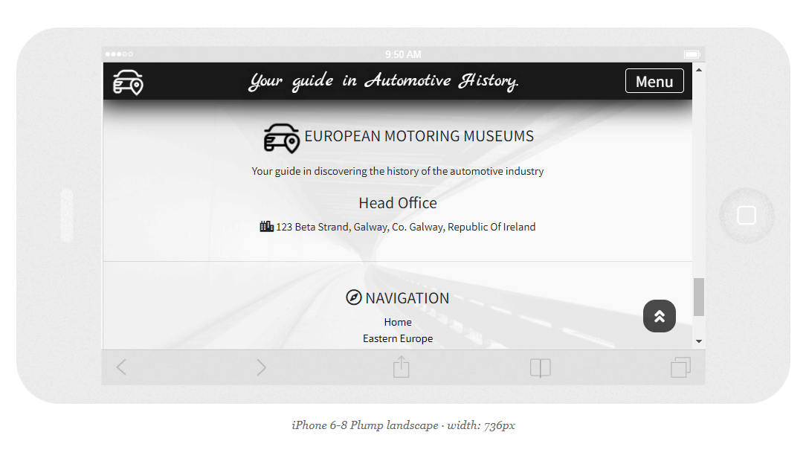
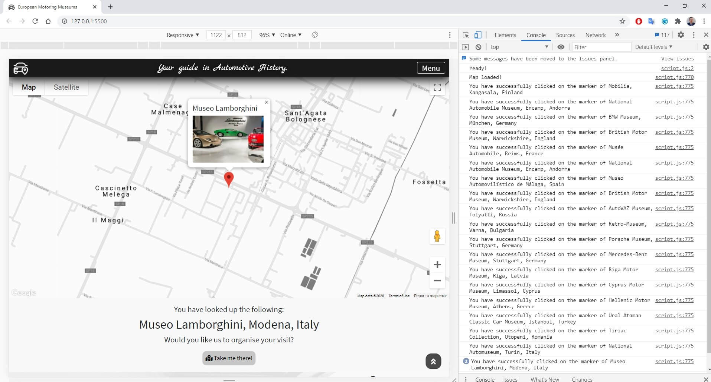
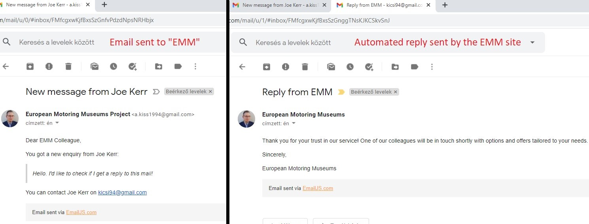
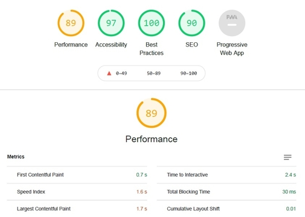
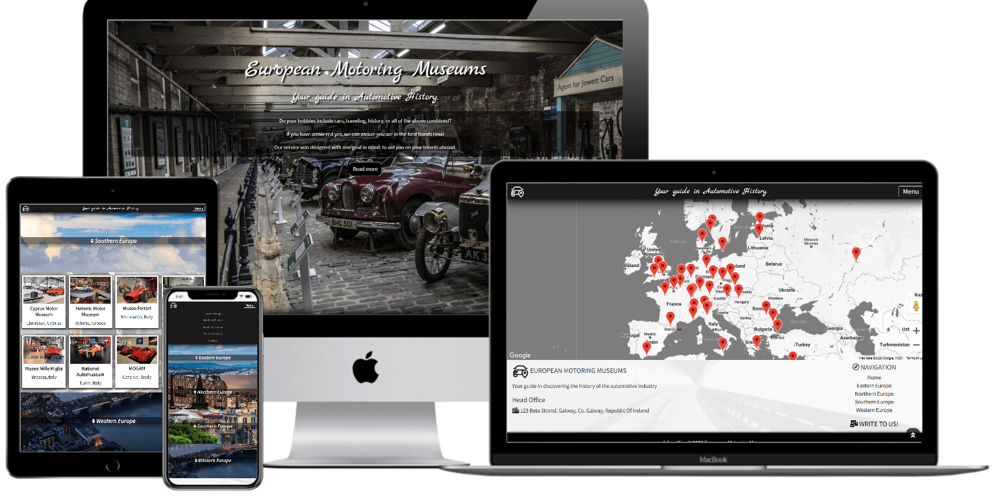

# European Motoring Museums

Code Institute Diploma in Full-Stack Web Development Milestone 2 Project

##### <u>Project name:</u> European Motoring Museums



### View the live project: https://adamsky94.github.io/European_Motoring_Museums/

### <u>Scope of the project</u>

The European Motoring Museums Organization /EMM in the following/ is a non-profit organization that is run by the European Museums Association. They have set up the EMM project with the intention of representing the member institution's general and seasonal exhibitions. The member museums are expected to have increased visitor numbers over time. To achieve this the EMM page was created as a showcase site, where future visitors can get information about the Museums and all other essential information for them to be able to visit. Part of the EMM project is organizing travel, booking tickets and accommodation if the individual contacts them through the form on the site. There are no prices, website referrals, phone numbers for any of the museums because EMM wants to be the one who's sharing the information directly to the individual after assessing the individual's needs.

-----------------
### <u>Contents</u>

- [UX Design](#ux-design--presentation)

- [Wireframing](#wireframing)

  - [Landing](#landing)
  - [Page layout](#page-layout)
  - [Contact Form](#contact-form)
  - [Navigation](#navigation)
  - [Footer](#footer)

- [Technologies Used](#technologies-used)
  - [Adding Email JS SDK](#adding-email-js-sdk)
  - [Adding the Google Maps API](#adding-the-google-maps-api)
  
- [Version Control](#version-control)

- [Testing write-up](#testing-write-up)

  - [Bug fixes](#bug-fixes)
  - [Lighthouse Speed Tool](#lighthouse-speed-tool)

- [Deployment](#deployment)

- [Cloning this repository](#cloning-this-repository)

- [Credits](#credits)

-----------------

### UX Design / Presentation

#### User Stories

###### As a visitor to the EMM site I expect:

- To be presented with an appealing page using appropriate quality and format imagery.
- To be presented a responsive website that looks good on multiple form factors and screen sizes.
- To be able to find the information I am looking for.
- To be able to easily navigate on the page.
- To be able to execute the expected functions on all the included links and buttons.
- To be able to get in touch with the service provider.

###### As the operator of the EMM site I expect:

- To provide basic information about EMM and it's services.
- To showcase the member institution's general and seasonal exhibitions.
- To generate increased ticket sales to the member museums.
- The customers to read what was published in the press about EMM. (like customer testimonials)
- Visitors to be able to interact with the included map.
- Visitors to easily navigate on the site not coming across any broken links or buttons.
- The customers to be invoked to contact EMM and avail of their services so they can provide personalized information to the future customer.

###### My thoughts as the developer:

"As a newbie learner, I wanted to create a more modern looking website than my first project. I tried to create something more visually appealing so whoever checks out my GitHub repository will see my improvement. Code Institute has provided us the GitPod IDE but around 70% done with the project I switched to develop locally with VS Code because of occasional "hiccups" with GitPod's servers. It was not too difficult because GitPod is based on VS Code so it was an easy transition. I pulled my repo for this project, committed, and pushed from VS Code since. I was able to reach everything quicker and it was nice to get to know how to install plugins and other functionalities!"

-----------------

#### **Wireframing**

###### Landing



> I wanted to create a large image background landing site with a button. The landing would scale on all viewports. Clicking on the button would bring the user to the main content as well as scrolling downwards.

###### Page layout



> The main feature of the page is the four sections that would reveal further information upon clicking on them. The four sections are Eastern, Northern, Southern, and Western Europe. These sections would be done as a parallax. Each section would have different background images. The background images would be fixed and centered so scrolling up and down would create a nice visual.
> On clicking these sections it would reveal buttons which are named by the countries they represent. There is just a solid background color on this section.
> Clicking on the Country's button would reveal a section that holds polaroid-like cards with images and the details of the respected museum. This section would have a faded background image of a dashboard of a classic car. This would be a different image under each Europe section.
> The cards would further have a button that would show the museum's location on a google maps map after flipping the card. 

###### Contact form



> The contact form would be on a modal and only visible after customer interaction with a link or button. The contact form would have a message on the top about EMM's service. It would have input fields for the full name, email address, and message. These input fields are required to be filled with appropriate data, otherwise, the user could not click the send button.

###### Map section



> There would be a google maps map under the parallax section. All the museums are marked with a marker and the markers are clustered on certain zoom levels. Visitors would be able to browse all the locations showcased above on the site.

###### Navigation

> The navbar would be only visible once the user got past the landing screen. After that point, the navbar would be always visible on the top of the page. It would have a logo on the left linked to the index page. The navigation links will be on the right side under a menu button only visible on clicking on it. In the middle, there would be a slogan text. All navigation elements would have basic animation applied. On small screen sizes, the slogan would not be visible.

###### Footer

> Information about the EMM would be displayed here like head office location and phone on one side. On the other side, there would be a navigation menu. The bottom of the footer would hold the copyright information.

**Color scheme and typography**

I have used the Mark Script and Source Sans Pro fonts from Google Fonts CDN. I have chosen the Mark Script because it's handwriting calligraphy style for the title. Every other visible text is using Source Sans Pro.

The site heavily relies on imagery so I wanted to find a balance between colors, toned down colors, and maybe monochrome. 

Whenever there is a background image I used faded images so it would not conflict with the foreground and all elements would be still clearly visible.

I gave the pages a black frame on the top and bottom with the navbar and the footer. 
There is a light-grey background color applied to the whole site. It is mostly not visible but it was important because of the second half of the page. As I was thinking of creating a contrast to the imagery so the imported Google Maps map element have been styled to be monochrome.

-----------------

### Technologies Used

- HTML5
- CSS3
- JavaScript
- Google Cloud Services - Google Maps API
- Google Maps Marker Clusterer
- Git Version Control 
- GitHub - to host the repository and the live site
- GitPod IDE - remote developer environment
- Microsoft Visual Studio Code - local code editor
- Balsamiq Wireframes - used in the design process for wireframing
- [Bootstrap](https://getbootstrap.com/) 
- [JQuery](https://jquery.com/)
- [Email JS](https://www.emailjs.com/) - for making the contact form alive
- [FontAwesome](https://fontawesome.com/) - for the icons used
- [Animate.css](https://animate.style/) - for animating element on the landing page 
- [LightGallery](http://sachinchoolur.github.io/lightGallery/) - for viewing the museum card images
- [SnazzyMaps](https://snazzymaps.com/) - for styling the map
- [Typora](https://typora.io/) - The README.md file was edited in Typora

#### Adding Email JS SDK

Adding this functionality to a website was covered in the Interactive Frontend Development module of the course. Those few videos were a great help. Firstly you have to be registered to this service then you will be able to link it with an existing email address. The official EmailJS documentation is also crucial to understand what has to be done in order to get everything in working order. You can find the documentation [here](https://www.emailjs.com/docs/introduction/how-does-emailjs-work/).

#### Adding the Google Maps API

Firstly you have to register for Google Cloud Services. It is easier if you already use Gmail for example. You can do that at the following [link](https://cloud.google.com/).

Once you logged in you have to set up billing for your account. Only then you are able to create a project and be able to use an API or an SDK. Here is the part of the documentation that helps you going through [these steps](https://developers.google.com/maps/gmp-get-started). 

For Google Maps you need to get a personal API key. Here is [how to do that](https://developers.google.com/maps/documentation/javascript/get-api-key). 

It's best practice to restrict the use of your API key in order to avoid unauthorized use and extra charges applied to your account. Google Cloud services actually sent me an email when I first pushed my HTML code to my repository on GitHub saying that it might accidentally have been published and the best thing would be to restrict access if it has not been done already. You can read more on how to do that [here](https://developers.google.com/maps/api-key-best-practices?hl=en). My API key is restricted. The Google Maps map in my project only functions if it's called from the Deployed Website on GitHub pages, GitPod, or LiveServer from VS Code when I use it locally. 

You can find information on how to place markers and use the marker clusterer on a map in the Google Maps JavaScript API Documentation [here](https://developers.google.com/maps/documentation/javascript/overview#maps_map_simple-javascript).

-----------------

### **Version Control**

I used Git for version control and uploading the project to GitHub.

My GitHub repository for this project is accessible [here](https://github.com/Adamsky94/European_Motoring_Museums).

### Testing write-up

HTML code validated on - https://validator.w3.org/

CSS code validated on - https://jigsaw.w3.org/css-validator/

**User Story Testing**

Responsivity for mobile devices tested on:

- [Responsinator](http://www.responsinator.com/) and [Multi Device Mockup Generator](https://techsini.com/multi-mockup/) 
- Google Chrome Developer Tools
- Mozilla Firefox on Galaxy S9 setting
- Opera Browser
- Microsoft Edge



Used online [Autoprefixer](https://autoprefixer.github.io/) for maximum browser compatibility 

Used online [Code formatter](https://webformatter.com/) to achieve optimal syntax 

Used online [Image compressor](https://imagecompressor.com/) and [TinyPNG](https://tinypng.com/) for achieving the fastest image loading times from the server 

Used [Lunapic](https://www.lunapic.com) online image editor when I had to change the opacity on an image 

- Manually clicking all links through the site, the map, and the README file to ensure they perform the expected action. Clicking a marker on the map writes to the console that the action was executed.



- Upon sending a message through the contact form, the site visitor will receive an automated email response to the email address they have provided previously in the form. I Tested this functionality with 2 of my email accounts. The left is linked with Email JS and the project itself is the receiver of the form. The right is the email provided while filling the form. This has got the automated message after clicking send.



##### Bug Fixes

- There's an animation on the museum card's body on hover. The contact form was also getting this animation because it is a card on modal. FIX: Created modal card hover CSS class and disabled animation
- Positioning issue of the button on the landing page when the website is viewed in landscape mode on mobile devices. FIX: Text on the landing page is hidden on small screen devices.
- Return-to-top button "stuck open", not losing focus on mobile devices after performing the action of returning to the top of the page. FIX: Disabled animation on mobile devices with CSS.
- Google Maps map marker clusterer loading issues. FIX: Re-organized scripts in HTML file.

##### Lighthouse Speed Tool

A member of Code Institute Anna Greaves has mentioned this handy tool in her ["How to README.md"](https://www.youtube.com/watch?v=7BteidgLAyM&feature=youtu.be&ab_channel=CodeInstitute) online webinar. After learning about it I tested my project in an advanced phase. This was the initial result: 



On further inspecting the findings of this test the tool brought my attention to the slow loading times of some images and recommended fixes for the issue. Here are the site metrics after performing said fixes:


There are loads of other things this tool inspects for you and has capabilities beyond mine. I most certainly going to use it with all my future projects to get a better understanding of how and why things are as they are at a given state!

-----------------

### Deployment

1. On GitHub, navigate to your site's repository.
2. Under your repository name, click **Settings**.
3. Under "GitHub Pages", use the **None** or **Branch** drop-down menu and select a publishing source.
4. Optionally, use the drop-down menu to select a folder for your publishing source.
5. Click **Save**.

#### The live project page: https://adamsky94.github.io/European_Motoring_Museums/



GitHub documentation for [deploying](https://docs.github.com/en/free-pro-team@latest/github/working-with-github-pages/configuring-a-publishing-source-for-your-github-pages-site) a project to GitHub Pages.

### Cloning this repository

If you'd like to see and work on my code locally feel free to clone the repository. When you clone a repository, you copy the repository from GitHub to your local machine. 

1. On GitHub, navigate to the main page of the repository.

2. Above the list of files, click **Code**.

3. To clone the repository using HTTPS, under "Clone with HTTPS", click . To clone the repository using an SSH key, including a certificate issued by your organization's SSH certificate authority, click **Use SSH**, then click . To clone a repository using GitHub CLI, click **Use GitHub CLI**, then click .

4. Open Git Bash.

5. Change the current working directory to the location where you want the cloned directory.

6. Type `git clone`, and then paste the URL you copied earlier.

   ```shell
   $ git clone https://github.com/Adamsky94/European_Motoring_Museums.git
   ```

7. Press **Enter** to create your local clone.

GitHub documentation on cloning repository includes other methods to using the console. You can read more [here](https://docs.github.com/en/free-pro-team@latest/github/creating-cloning-and-archiving-repositories/cloning-a-repository).

-----------------

### Credits

***Antonio Rodgrigez*** - My mentor at Code Institute - for general feedback and guidance, special guidance on Google Maps

***Bence Kiss*** - My brother, helping to set up LightGallery

***Matt Rudge*** - Lecturer/Developer at Code Institute - for the [template](https://github.com/Code-Institute-Org/gitpod-full-template) used with GitPod IDE for developing this project, and the lecture on Email JS

***Anna Greaves*** - Developer at Code Institute - for the ["How to README.md"](https://www.youtube.com/watch?v=7BteidgLAyM&feature=youtu.be&ab_channel=CodeInstitute) webinar

***Brad Traversy*** - for the [full screen landing page](https://codepen.io/bradtraversy)

***Simen Daehlin*** -  for the [parallax](https://github.com/Eventyret/simple-parallax)

***Mahesh Ambure*** - for the [testimonial slider](https://codepen.io/maheshambure21/pen/qZZrxy)

***Ross Dallaire*** - for [return-to-top arrow](https://codepen.io/rdallaire/pen/apoyx)

***Mezo Istvan*** - for [solution](https://medium.com/@mezoistvan/finally-a-css-only-solution-to-hover-on-touchscreens-c498af39c31c) to the touchscreen :hover state of return-to-top arrow

***Paul Saxman*** - tutorial video on [using SnazzyMaps](https://www.youtube.com/watch?v=iPq69CnYxMA&ab_channel=GoogleDevelopers)

***@Ehsan*** on StackOwerflow - for [changing placeholder text](https://stackoverflow.com/questions/13506481/change-placeholder-text) after submitting form

***@geocodezip*** on StackOwerflow - for the event listener on when [marker infowindow gets closed](https://stackoverflow.com/questions/38992746/how-to-zoom-out-the-map-when-the-infowindow-is-closed-in-google-map/)

***@Kyle*** on StackOwerflow - for adding [text outline](https://stackoverflow.com/questions/4919076/outline-effect-to-text) effect in CSS

***Bootstrap*** - for providing [documentation](https://getbootstrap.com/docs/4.5/getting-started/introduction/) on the framework

***W3schools*** - for various code segments, examples and [explanations](https://www.w3schools.com/) used throughout the project

***Font Awesome*** - CDN for [icons](https://fontawesome.com/) used in the project

***Google Fonts*** - CDN for [fonts](https://fonts.google.com/) used in the project

***Google Cloud Platform*** - For their [Google Maps API](https://cloud.google.com/)

***Animate.css*** - for [animation](https://animate.style/) on the landing page

***Wikipedia*** - [List](https://en.wikipedia.org/wiki/List_of_automotive_museums#Europe) of European Motoring Museums

***Pexels*** - for [images](https://www.pexels.com/) used in the project

***Material Design for Bootstrap*** - https://mdbootstrap.com/ - for Modal Contact Form, Card layout and Footer

***LightGallery*** - http://sachinchoolur.github.io/lightGallery/ 

***JQuery*** - https://jquery.com/

***Autoprefixer CSS online*** - https://autoprefixer.github.io/